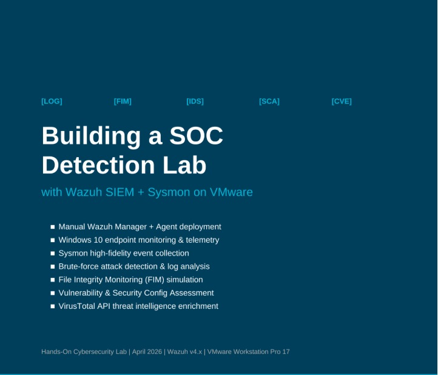

# 🛡️ SOC Detection Lab — Wazuh SIEM + Sysmon on Windows 10

> **Enterprise-grade SOC detection lab** integrating Wazuh SIEM with Sysmon high-fidelity telemetry on Windows 10 — detecting brute-force attacks, file integrity violations, malware staging, and behavioral anomalies in real time.

**Prepared by:** Ayesha | Information Security Analyst  
**Platform:** VMware Workstation Pro 17  
**Date:** April 2026

---

