# 🛡️ SOC Detection Lab — Wazuh SIEM + Sysmon on Windows 10


> **Enterprise-grade SOC detection lab** integrating Wazuh SIEM with Sysmon high-fidelity telemetry on Windows 10 — detecting brute-force attacks, file integrity violations, malware staging, and behavioral anomalies in real time.

**Prepared by:** Ayesha | Information Security Analyst  
---


## Lab Overview

This project demonstrates an enterprise-grade **SOC detection pipeline** built on Wazuh SIEM with Sysmon high-fidelity telemetry on a Windows 10 endpoint. The lab covers the full detection lifecycle — from network setup and agent deployment to brute-force detection, file integrity monitoring, VirusTotal threat intelligence, and behavioral malware detection.

### What Was Demonstrated
- ✅ Manual Wazuh Manager + Agent deployment on VMware
- ✅ Windows 10 endpoint monitoring & telemetry via Sysmon
- ✅ Brute-force attack detection — 38 logon failure alerts
- ✅ File Integrity Monitoring (FIM) — file add/delete events captured
- ✅ VirusTotal API integration — EICAR test detected by 67 engines
- ✅ Behavioral detection — suspicious svchost.exe + net.exe discovery
- ✅ Executable drop detection — malware staging folder alerts
- ✅ MITRE ATT&CK technique mapping (T1087)

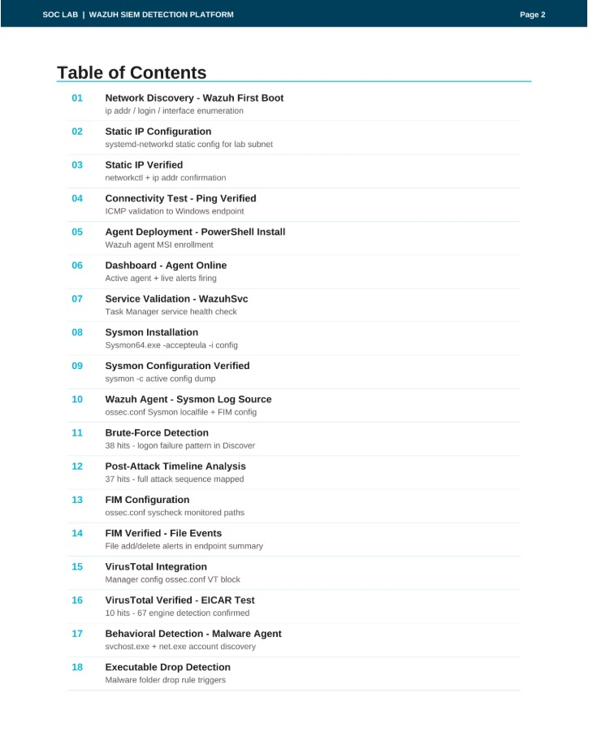

## Lab Architecture

| Host | IP Address | Role |
|------|-----------|------|
| Wazuh Manager | 150.1.7.158 | SIEM Manager (eth1 static) |
| Windows 10 | 150.1.7.100 | Primary Endpoint (Agent win10) |
| Windows 10 Malware | 150.1.7.110 | Malware Simulation Endpoint |

## Tools & Technologies

| Tool | Version | Purpose |
|------|---------|---------|
| Wazuh SIEM | v4.x | Security Information & Event Management |
| Sysmon | v15.20 | High-Fidelity Windows Telemetry |
| VirusTotal API | — | Threat Intelligence Enrichment |
| VMware Workstation | Pro 17 | Virtualization Platform |
| PowerShell | — | Agent Deployment & Administration |

---

## Step 01 — Network Discovery & Wazuh First Boot

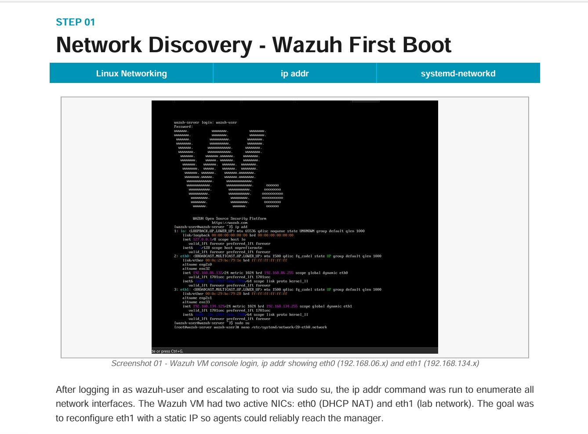

After first boot, the Wazuh Manager VM was logged into and the `ip addr` command was run to enumerate all active network interfaces. Two NICs were discovered — **eth0** (DHCP NAT for internet access) and **eth1** (lab network, initially receiving a DHCP address from VMware).

**Why this matters from a SOC perspective:**
In a real enterprise deployment, the SIEM manager must have a **fixed, predictable IP address**. If the manager IP changes due to DHCP lease renewal, all enrolled agents lose connectivity and stop forwarding logs — creating a dangerous blind spot where attacks go undetected. This is why static IP configuration is a mandatory first step before any agent enrollment.

**What an attacker exploits:**
Adversaries performing internal reconnaissance (MITRE T1046 — Network Service Discovery) actively look for SIEM and logging infrastructure to target first. Taking down log forwarding is a common attacker priority to avoid detection during lateral movement.

**Key Points:**
- eth0: DHCP NAT — internet connectivity for package downloads
- eth1: lab network NIC — needs static IP for reliable agent communication
- `ip addr` reveals interface names, MAC addresses, and current IP assignments
- Both NICs confirmed UP and BROADCAST — no link-layer issues

## Step 02 — Static IP Configuration via systemd-networkd

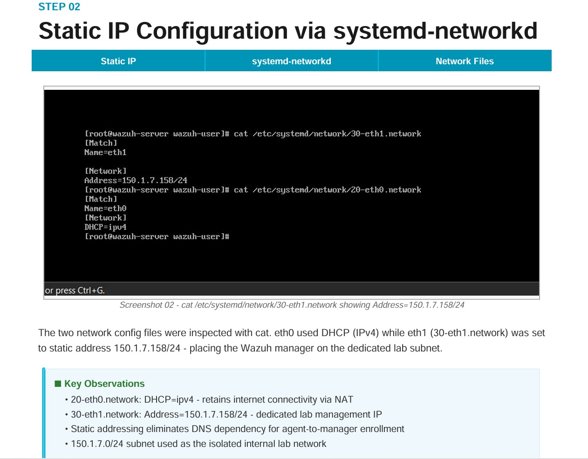

The two network configuration files were edited using `nano` to assign a permanent static address to eth1. On modern Linux systems using `systemd-networkd`, network interfaces are configured via `.network` files stored in `/etc/systemd/network/`. Each file matches an interface by name and applies the specified network settings on boot.

**Why static IP matters technically:**
Wazuh agents use the manager IP hardcoded during enrollment. If that IP changes, the agent cannot reconnect without manual re-enrollment. In a production SOC with hundreds of endpoints, a single IP change on the manager can cause mass log forwarding failure — making static addressing a non-negotiable requirement.

**Why attackers care about this:**
If an attacker can manipulate DNS or DHCP to redirect agent traffic away from the legitimate Wazuh manager, they can silently disable log forwarding without touching the SIEM itself — a sophisticated evasion technique seen in advanced persistent threat (APT) operations.

**Key Points:**
- `20-eth0.network` — DHCP=ipv4, retains internet connectivity via NAT
- `30-eth1.network` — Address=150.1.7.158/24, dedicated lab management IP
- Static addressing eliminates DNS dependency for agent-to-manager enrollment
- 150.1.7.0/24 used as the isolated internal lab network
- Numbered prefixes (20-, 30-) control processing order in systemd-networkd

---

## Step 03 — Static IP Verified

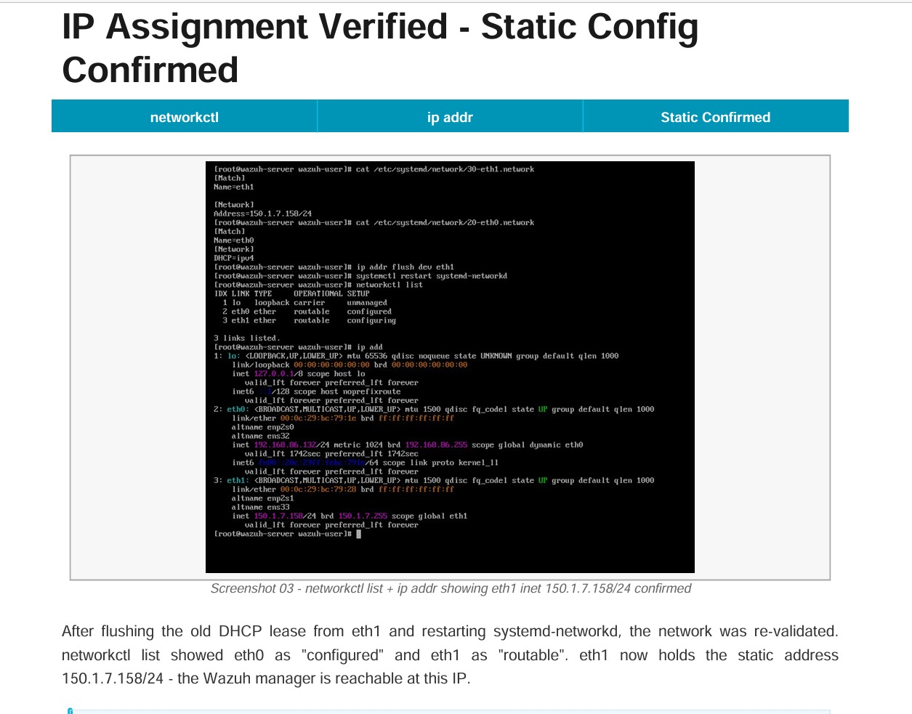

After editing the config files, the old DHCP lease was flushed from eth1 using `ip addr flush dev eth1` and systemd-networkd was restarted to apply changes. The `networkctl list` command confirmed eth0 as "configured" and eth1 as "routable" — meaning eth1 has a valid route and is ready to accept agent connections.

**Why verification matters:**
In SOC deployments, never assume a configuration change worked — always verify. A misconfigured network file can silently fail, leaving eth1 with no IP while appearing UP at the link layer. The `ip addr` output showing `inet 150.1.7.158/24` with `valid_lft forever` confirms the address is permanently assigned and will survive reboots.

**Key Points:**
- `ip addr flush dev eth1` removes old DHCP lease before applying static config
- `networkctl list` shows operational state — "routable" means fully functional
- `valid_lft forever` confirms static assignment — no expiry
- eth1 now reachable at **150.1.7.158** from all lab machines

## Step 04 — Connectivity Test — Lab Network Ping Verified

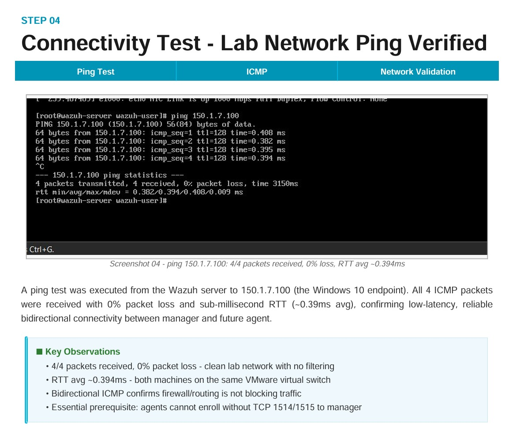

Before deploying any agents, a ping test was executed from the Wazuh server to the Windows 10 endpoint at 150.1.7.100. All 4 ICMP packets were received with 0% packet loss and sub-millisecond RTT (~0.394ms avg), confirming clean bidirectional connectivity between manager and future agent.

**Why this step is critical:**
Wazuh agents communicate with the manager over **TCP port 1514** (log forwarding) and **TCP port 1515** (agent enrollment). If ICMP is blocked or routing is broken, agent enrollment will silently fail with no meaningful error message — making connectivity verification an essential pre-deployment check. Many SOC deployments fail at this stage due to firewall rules blocking these ports between network segments.

**What attackers exploit here:**
During lateral movement, attackers specifically target the communication channel between SIEM agents and managers. By blocking TCP 1514/1515 on a compromised host using Windows Firewall rules, an attacker can silently disconnect that endpoint from the SIEM — buying time to operate undetected while appearing to the SOC as a connectivity issue rather than an attack.

**Key Points:**
- 4/4 packets received — 0% packet loss confirms no filtering
- RTT avg ~0.394ms — both machines on the same VMware virtual switch
- Bidirectional ICMP confirms firewall/routing not blocking traffic
- Sub-millisecond latency confirms VMware internal network — no external routing
- Essential prerequisite — agents cannot enroll without TCP 1514/1515 to manager

---

## Step 05 — Agent Deployment — Windows 10 Endpoint Enrollment

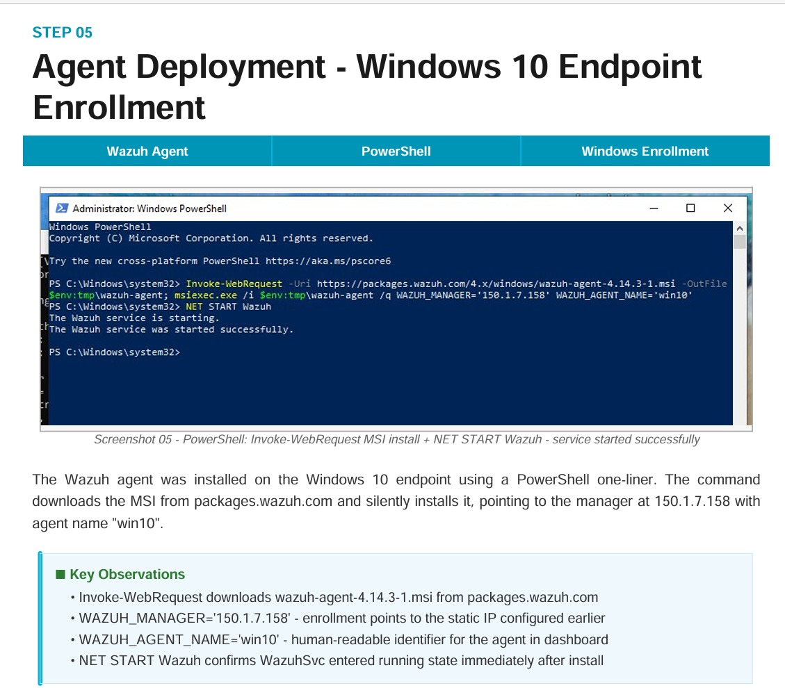

The Wazuh agent was installed on the Windows 10 endpoint using a single PowerShell command. `Invoke-WebRequest` downloads the MSI installer directly from Wazuh's package repository, and `msiexec` silently installs it while passing the manager IP and agent name as environment variables. This one-liner approach mirrors real enterprise deployment methods used with tools like SCCM or Ansible.

**Why PowerShell deployment matters:**
In enterprise environments, security tools must be deployable silently and at scale without user interaction. The `/q` flag in msiexec suppresses all UI, making this suitable for automated deployment pipelines. The `WAZUH_MANAGER` variable hardcodes the manager IP into the agent configuration at install time — eliminating the need for post-install configuration.

**What attackers do with this knowledge:**
Attackers who gain admin access to a Windows endpoint sometimes uninstall or disable security agents as a first step. Understanding the installation method helps defenders detect unauthorized agent removal — Wazuh itself generates alerts when an agent goes offline, which should be treated as a high-priority security event rather than a routine IT issue.

**Key Points:**
- `Invoke-WebRequest` downloads wazuh-agent-4.14.3-1.msi from packages.wazuh.com
- `WAZUH_MANAGER='150.1.7.158'` — enrollment points to the static IP configured earlier
- `WAZUH_AGENT_NAME='win10'` — human-readable identifier for dashboard identification
- `/q` flag — silent install with no user interaction required
- `NET START Wazuh` confirms WazuhSvc entered running state immediately after install

 ## Step 06 — Agent Online — Dashboard Shows Active Connection

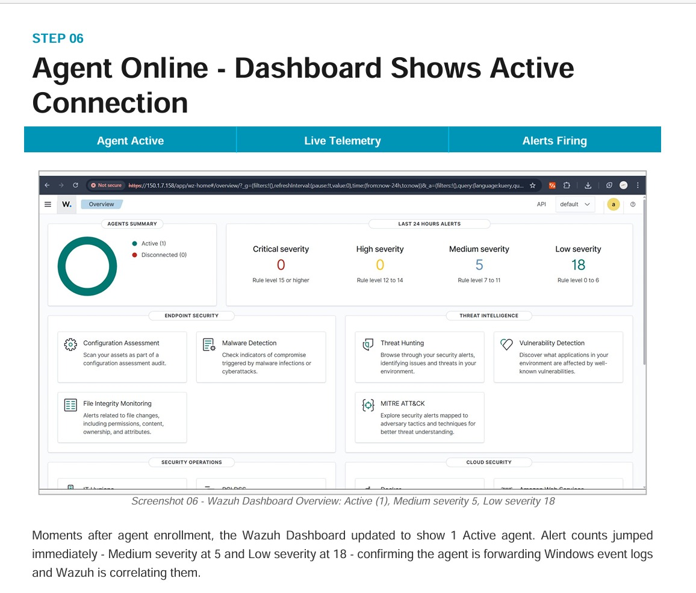

Moments after agent enrollment, the Wazuh Dashboard updated to show 1 Active agent with immediate alert generation — Medium severity at 5 and Low severity at 18. This instant alert burst is completely normal and expected behavior. It represents Wazuh performing its initial baseline scan of the Windows endpoint — checking running processes, open ports, installed software, and security configuration against its built-in ruleset.

**Why immediate alerts are a good sign:**
A newly enrolled agent that generates zero alerts should actually concern a SOC analyst. It likely means log forwarding is broken or the agent is not properly reading Windows event channels. The burst of Low and Medium alerts on first connection confirms the agent is actively collecting telemetry and Wazuh is successfully correlating events against its detection rules.

**What the severity levels mean:**
- **Critical (15+):** Immediate response required — active exploitation
- **High (12-14):** Serious threat requiring urgent investigation
- **Medium (7-11):** Suspicious activity requiring analyst review
- **Low (0-6):** Informational — policy violations, baseline deviations

**What attackers try to avoid:**
Sophisticated attackers deliberately operate slowly after initial access to avoid triggering alert bursts. They know SIEM platforms flag unusual activity spikes. By staying within normal behavioral baselines — using existing tools, avoiding new process creation — they attempt to blend into the noise of Low severity alerts that analysts often deprioritize.

**Key Points:**
- ✅ Active (1) — agent connected and heartbeating successfully
- ✅ Medium severity: 5 alerts — initial baseline scan findings
- ✅ Low severity: 18 alerts — policy and configuration observations
- ✅ Zero Critical/High confirms clean baseline — no immediate threats
- ✅ Full pipeline confirmed: Windows logs → Wazuh agent → SIEM correlation

---

## Step 07 — Service Validation — WazuhSvc Running in Windows

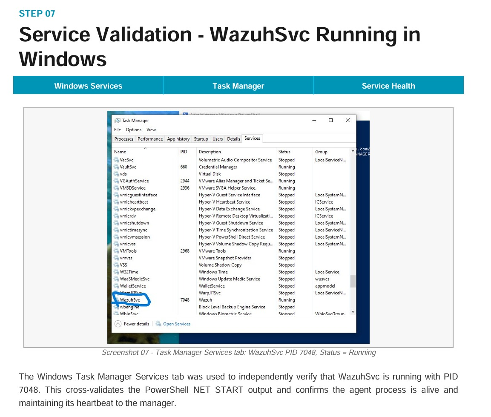

The Windows Task Manager Services tab was used to independently verify WazuhSvc is running with PID 7048. This cross-validation step is important because a service can appear started in PowerShell output but actually be in a crash-restart loop. Task Manager provides OS-level confirmation that the process is genuinely alive and consuming resources.

**Why independent verification matters in SOC:**
In security deployments, trust but verify is a core principle. The NET START command confirms the service started successfully at that moment — but Task Manager confirms it is still running after enrollment completed. A WazuhSvc process that crashes and restarts repeatedly will appear in PowerShell as "running" but will have gaps in log collection that create detection blind spots.

**What attackers do to security services:**
A common post-exploitation technique is to stop or disable security agent services using `sc stop WazuhSvc` or `sc config WazuhSvc start=disabled`. Defenders should configure Wazuh manager alerts for agent disconnection events and treat any unexpected WazuhSvc termination as a potential security incident rather than a routine service issue.

**Key Points:**
- WazuhSvc PID **7048** confirmed running in Task Manager Services tab
- Cross-validates PowerShell NET START output independently
- Running status confirms agent is maintaining heartbeat to manager at 150.1.7.158
- Service visible alongside VMware tools and other system services
- PID tracking allows correlation with process events in Sysmon logs

## Step 08 — Sysmon Installation — High-Fidelity Telemetry

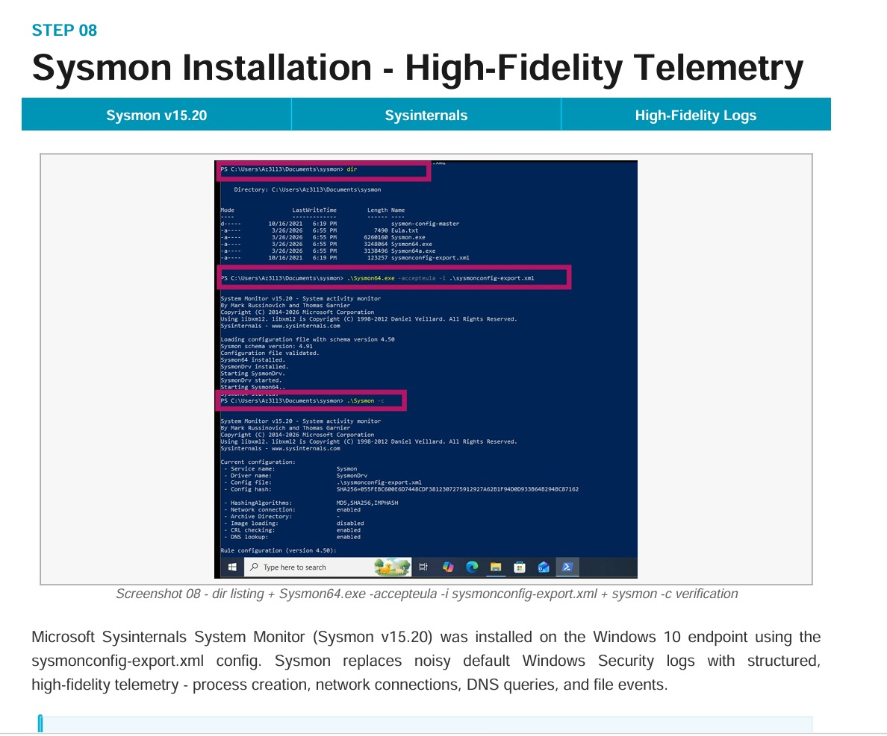

Microsoft Sysinternals System Monitor (Sysmon v15.20) was installed on the Windows 10 endpoint using a community-maintained configuration file (sysmonconfig-export.xml). Sysmon operates as a Windows kernel-level driver, intercepting system calls and logging events that the default Windows Security event log completely misses — including process injection, DNS queries, network connections by process name, and file creation with hash values.

**Why default Windows logs are not enough:**
Default Windows Security logs record Event ID 4688 (process creation) only if specifically enabled via Group Policy, and even then they capture minimal metadata — just the process name and parent. Sysmon's Event ID 1 (Process Create) captures the full command line, file hash, parent process details, and the user context — giving analysts the forensic depth needed to distinguish legitimate activity from attacker techniques.

**The difference Sysmon makes in practice:**
Consider a malicious PowerShell script running on an endpoint. Default Windows logs show: `powershell.exe started`. Sysmon shows: `powershell.exe -EncodedCommand <base64 payload> spawned by winword.exe (a macro-enabled document) with SHA256 hash matching known malware` — a completely different level of investigative detail that makes the difference between detecting an attack and missing it entirely.

**Why attackers fear Sysmon:**
Sysmon's network connection logging (Event ID 3) captures outbound C2 connections with the originating process name and destination IP — making it extremely difficult for malware to establish command and control without generating a detectable event. This is why many malware families specifically check for Sysmon's presence and attempt to terminate its driver before proceeding.

**Key Points:**
- Sysmon v15.20 installed via Sysinternals — kernel-level driver for deep visibility
- Config: sysmonconfig-export.xml (schema version 4.50) — community hardened ruleset
- Hashing: MD5, SHA256, IMPHASH — three algorithms for multi-platform IOC matching
- Network connection monitoring enabled — captures C2 traffic by process
- DNS lookup tracking enabled — detects DNS-based C2 and data exfiltration
- Image loading disabled — reduces noise while retaining critical events

---

## Step 09 — Sysmon Configuration Verified


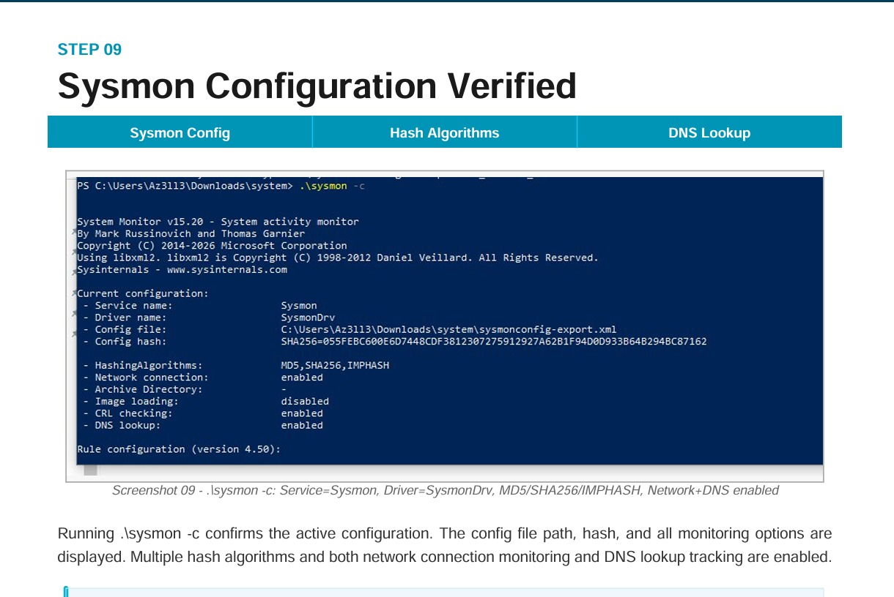

Running `.\sysmon -c` dumps the active running configuration directly from the Sysmon driver — confirming what rules are actually loaded in memory, not just what is on disk. This distinction matters because a failed config reload can leave old rules active while the config file shows updated content. The SHA256 config hash provides a tamper-detection mechanism — if the hash changes unexpectedly, someone modified the Sysmon configuration.

**Why configuration integrity matters:**
Attackers who gain admin access sometimes modify Sysmon configurations to exclude their tools from logging. For example, adding an exclusion rule for a specific process name or hash prevents Sysmon from logging that process — creating a blind spot specifically tailored to their malware. Monitoring the Sysmon config hash for unexpected changes is itself a detection opportunity.

**What each verified setting means for detection:**
- **MD5/SHA256/IMPHASH hashing** — enables IOC matching against threat intelligence feeds. IMPHASH (import hash) is particularly powerful because it identifies malware families even when the file is repacked or renamed
- **Network connection monitoring** — every outbound connection logged with process name, destination IP, and port — essential for C2 detection
- **DNS lookup enabled** — captures DNS queries before they leave the system — detects domain generation algorithm (DGA) malware and DNS tunneling

**Key Points:**
- `.\sysmon -c` reads active config from driver — not just disk file
- Config hash SHA256 verified — tamper detection baseline established
- Service: Sysmon | Driver: SysmonDrv — both components confirmed loaded
- Network connection monitoring enabled — C2 traffic detection active
- DNS lookup enabled — DGA and DNS tunneling detection active
- Rule configuration version 4.50 — current schema fully supported


## Step 10 — Wazuh Agent Config — Sysmon Log Source & FIM

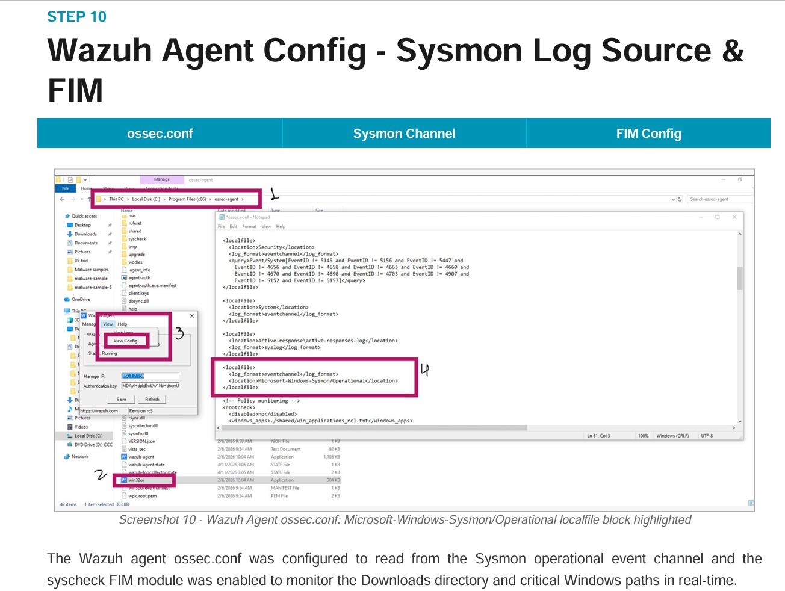

With Sysmon installed, the Wazuh agent ossec.conf was configured with two critical blocks — the Sysmon event channel localfile block and the FIM syscheck block. Together these two configurations transform Wazuh from a basic log collector into a genuine endpoint detection platform.

**The Sysmon integration — why it changes everything:**
Out of the box, Wazuh reads Windows Security and System event logs. These logs are designed for IT administration, not security detection. They tell you a process started but not what arguments it used. They tell you a network connection was made but not which process made it. Sysmon fills every one of these gaps. By pointing Wazuh at the Sysmon/Operational event channel, every process creation, network connection, DNS query, and file creation now arrives in Wazuh with full forensic context — transforming vague IT events into actionable security alerts.

**The FIM module — catching what signatures miss:**
Signature-based antivirus detects known malware. FIM detects unauthorized change — a fundamentally different and complementary detection approach. An attacker dropping a custom implant with no existing signature will bypass antivirus silently. But they cannot bypass FIM — the moment a new file appears in a monitored directory, Wazuh fires an alert regardless of what the file is or whether it has ever been seen before. The `realtime` mode uses Windows kernel filesystem notifications rather than periodic scanning — meaning detection happens in milliseconds, not minutes.

**Attacker perspective:**
The Downloads directory is the most abused staging location in Windows environments. Phishing attachments land there. Malicious tools get downloaded there. Post-exploitation frameworks drop their payloads there. Monitoring it with realtime FIM closes one of the most commonly exploited blind spots in Windows endpoint security.

```xml
<localfile>
  <log_format>eventchannel</log_format>
  <location>Microsoft-Windows-Sysmon/Operational</location>
</localfile>

<syscheck>
  <disabled>no</disabled>
  <directories check_all="yes" realtime="yes"
  report_changes="yes">C:\Users\*\Downloads</directories>
</syscheck>
```

**Key Points:**
- Sysmon/Operational channel delivers process, network, DNS and file events to Wazuh
- `eventchannel` format preserves full XML structure of every Sysmon event
- FIM realtime mode uses Windows kernel notifications — millisecond detection
- `check_all` monitors hash, size, permissions, ownership and content simultaneously
- `report_changes` captures exact content diffs — shows what changed inside a file
- Wildcard path covers Downloads folder for every user account on the machine
## Step 11 — Brute-Force Simulation — Logon Failures Detected

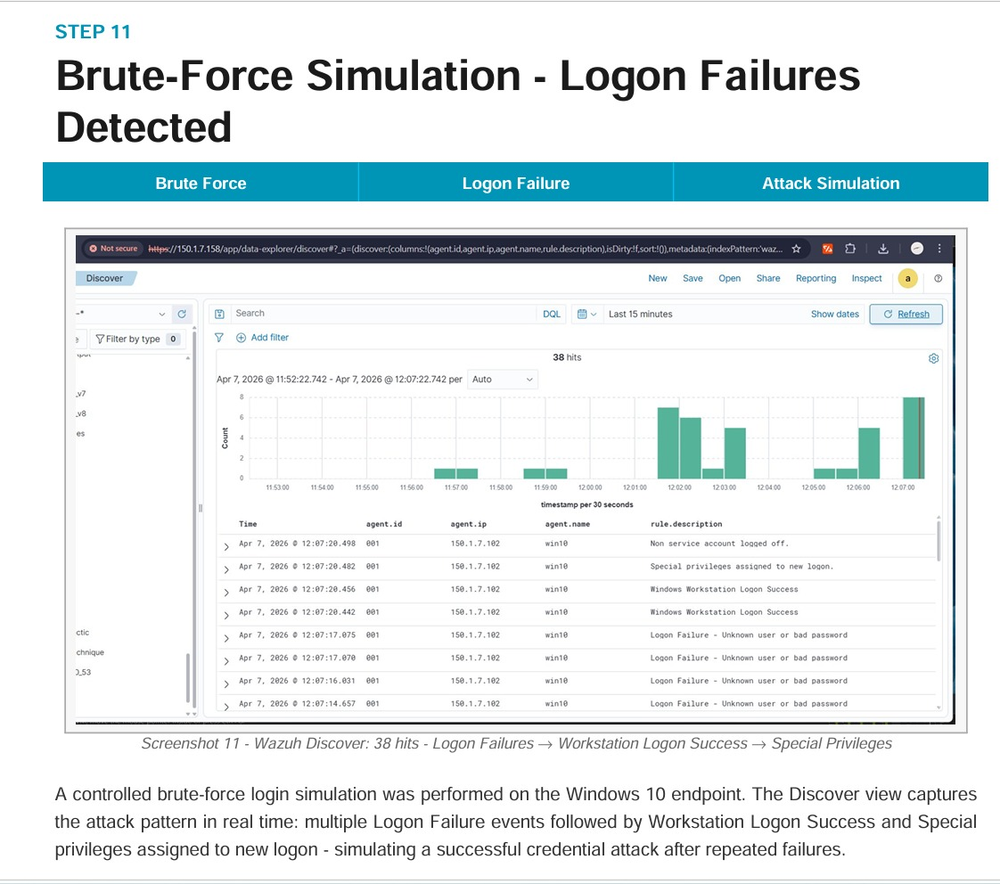

A controlled brute-force login simulation was performed against the Windows 10 endpoint. The attack deliberately submitted multiple incorrect credentials before finally succeeding — replicating the exact pattern of a real credential stuffing or password spraying attack. Wazuh detected the full attack sequence in real time, generating 38 alerts that captured every stage from initial failure through to successful authentication and privilege assignment.

**How brute-force detection works in Wazuh:**
Wazuh uses correlation rules rather than single-event matching for brute-force detection. A single failed login (Windows Event ID 4625) generates a Low severity alert. But when Wazuh observes multiple 4625 events from the same source within a short timeframe, it triggers a higher severity composite rule — recognizing the pattern as brute-force activity rather than a user mistyping their password once.

**Why the full sequence matters for SOC analysts:**
The most dangerous moment in a brute-force attack is not the failures — it is the success. Many SIEM deployments alert on logon failures but fail to correlate them with the subsequent successful logon. In Wazuh Discover, the complete kill chain is visible in a single timeline view:
- **Event ID 4625** — Logon Failure (wrong password)
- **Event ID 4624** — Workstation Logon Success (attacker gained access)
- **Event ID 4672** — Special Privileges assigned to new logon (privilege escalation)

This three-event sequence is a textbook indicator of a successful credential attack and should trigger immediate incident response in any SOC.

**MITRE ATT&CK mapping:**
This attack maps to **T1110 — Brute Force**, specifically the **T1110.001 Password Guessing** sub-technique. The subsequent privilege event maps to **T1078 — Valid Accounts** — the attacker is now operating with legitimate credentials, making detection significantly harder from this point forward.

**Key Points:**
- 38 total hits capturing complete attack lifecycle in Wazuh Discover
- Attack pattern: Logon Failures → Logon Success → Special Privileges
- Windows Event IDs correlated: 4625 (failure), 4624 (success), 4672 (privileges)
- Agent: win10 (150.1.7.102) — primary Windows endpoint
- MITRE T1110.001 Password Guessing + T1078 Valid Accounts
- Demonstrates Wazuh composite rule correlation — not just single event matching

---

## Step 12 — Post-Attack Event Timeline Analysis

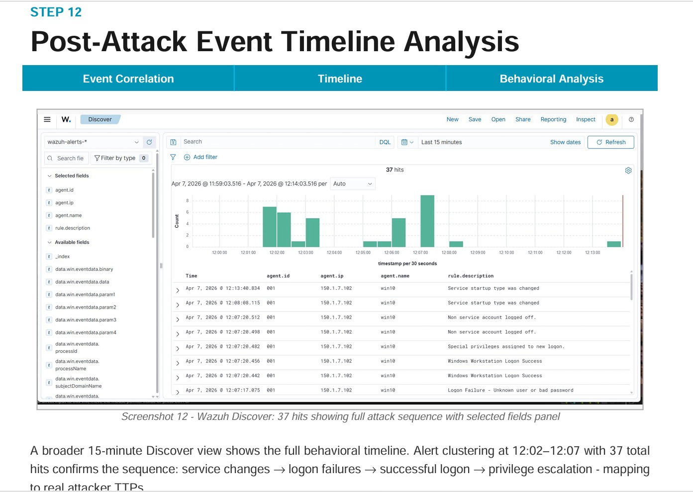

After the brute-force attack completed, the Wazuh Discover view was expanded to a 15-minute window to map the full behavioral timeline. This post-attack analysis is a core SOC skill — reconstructing exactly what happened, in what order, and what it means from an attacker perspective.

**Reading the attack timeline like a SOC analyst:**
The alert clustering visible in the Discover histogram tells a story. The initial spike represents the brute-force phase — rapid repeated logon failures in a short window. The cluster that follows represents post-authentication activity — service changes, privilege escalation, and session activity. The gap between clusters is significant — it represents the moment the attacker gained access and paused before proceeding, a behavioral pattern commonly seen in human-operated attacks.

**Why service startup changes are a critical indicator:**
The "Service startup type was changed" alert is often overlooked by junior analysts who focus on logon events. In reality, changing a service startup type is a classic persistence technique — **MITRE T1543.003 Windows Service**. Attackers modify legitimate service configurations to ensure their tools survive reboots. Seeing this event immediately after a successful logon in the same timeline window is a strong indicator of post-exploitation persistence activity.

**Key Points:**
- 37 hits across 15-minute window — full attack sequence mapped
- Alert clustering reveals attack phases: brute-force → access → persistence
- Service startup type changed — MITRE T1543.003 persistence indicator
- Non service account logged off — session cleanup post-exploitation
- Special privileges assigned — privilege escalation confirmed
- Timeline analysis transforms raw alerts into an actionable incident narrative

 ## Step 13 — File Integrity Monitoring — FIM Configuration


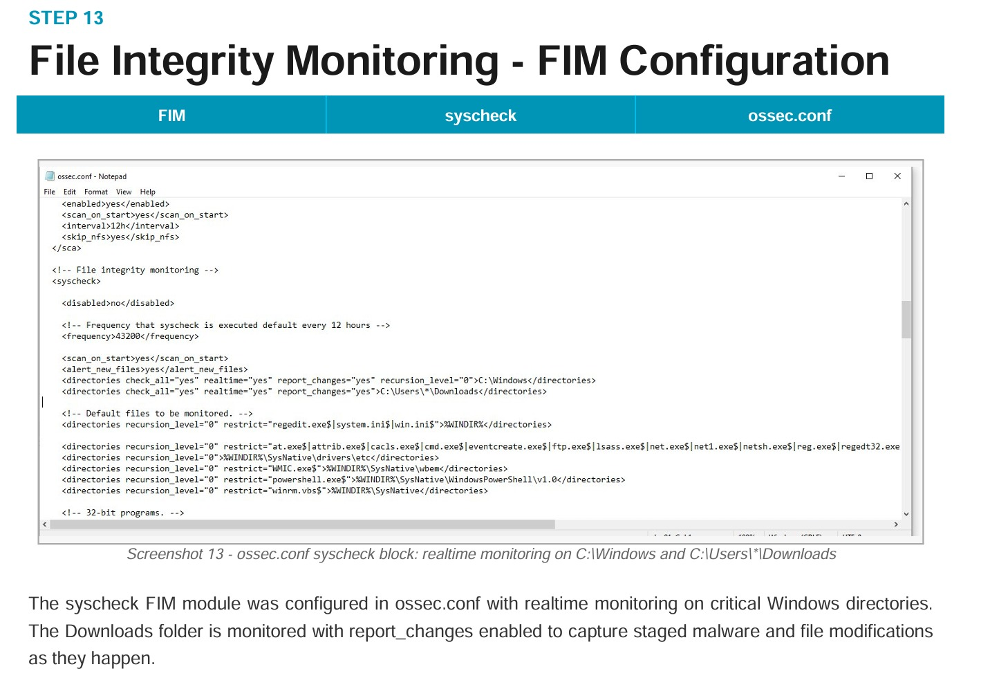

File Integrity Monitoring is one of the oldest and most reliable detection techniques in security — and for good reason. Every attacker interaction with a filesystem leaves a trace. Malware must write itself to disk before executing. Persistence mechanisms modify registry keys and configuration files. Data exfiltration staging creates temporary files. FIM catches all of these by monitoring not just whether a file exists but tracking its exact cryptographic hash, permissions, ownership, size, and content — alerting the moment any attribute changes.

**How Wazuh FIM works technically:**
Wazuh's syscheck module operates in two modes. In standard mode it performs periodic full scans at a configured interval (default every 12 hours) — computing hashes of all monitored files and comparing against a stored baseline database. In realtime mode it registers with the Windows kernel's filesystem change notification API, receiving an interrupt the moment any monitored file is created, modified, or deleted. This eliminates the scan interval gap where an attacker could create, use, and delete a file between scans without detection.

**Why monitoring critical Windows paths matters:**
The configuration monitors `C:\Windows` and `C:\Users\*\Downloads` with realtime monitoring. Windows system directories are gold for attackers — DLL hijacking (MITRE T1574), binary replacement, and living-off-the-land binary abuse all require writing to or modifying files in system paths. Any unauthorized modification to files in `C:\Windows\System32` should be treated as a critical security event requiring immediate investigation.

**The restrict directives explained:**
The configuration includes restrict rules for dangerous executables like `cmd.exe`, `powershell.exe`, `net.exe`, `lsass.exe`, `reg.exe`, and others. These restrictions tell Wazuh to generate high-priority alerts specifically when these binaries are accessed or modified — because legitimate software rarely needs to modify these files, while attackers frequently abuse them as LOLBins (Living Off the Land Binaries).

**Key Points:**
- FIM syscheck module configured with realtime kernel notifications
- `scan_on_start=yes` — immediate baseline scan on agent startup
- `alert_new_files=yes` — every new file in monitored paths generates alert
- `report_changes=yes` — captures exact content diffs for forensic analysis
- `C:\Windows` monitored — detects DLL hijacking and binary tampering
- `C:\Users\*\Downloads` monitored — catches malware staging and phishing payloads
- Restrict rules on LOLBins — cmd.exe, powershell.exe, net.exe, lsass.exe
- 12-hour scan interval for non-realtime paths as comprehensive backup

---

## Step 14 — FIM Verified — File Add/Delete Events Captured

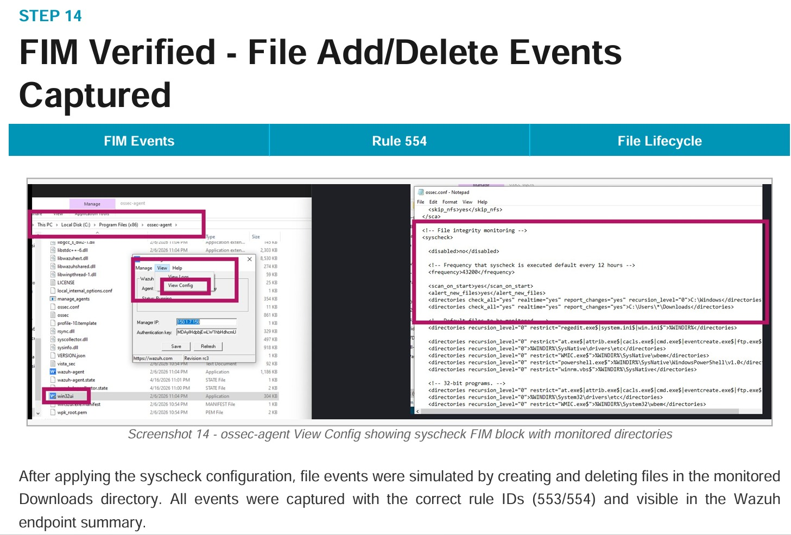

After applying the syscheck configuration, file lifecycle events were simulated in the monitored Downloads directory — creating files, modifying them, and deleting them. Every event was captured by Wazuh with the correct rule IDs and appeared immediately in the endpoint summary dashboard, confirming the realtime pipeline was functioning end-to-end.

**What the rule IDs mean:**
- **Rule 554** — File added to the system. Any new file appearing in a monitored directory triggers this rule. In a SOC context, this is the first indicator of malware staging, tool deployment, or unauthorized software installation.
- **Rule 553** — File deleted from the system. Attackers frequently delete tools and payloads after use to remove evidence. Rule 553 catches this cleanup activity — paradoxically, the deletion itself becomes evidence of malicious intent.

**Why file deletion alerts are undervalued:**
Many SOC teams focus on file creation alerts and ignore deletion events. This is a mistake. An attacker who downloads a tool, executes it, and deletes it within 30 seconds will only appear in logs as a brief Rule 554 followed by Rule 553. Without FIM, this entire activity is invisible. With realtime FIM both events are captured with timestamps, allowing analysts to calculate exactly how long the file existed and correlate it with process execution events from Sysmon during the same window.

**Key Points:**
- Rule 554 triggered — file added events captured in realtime
- Rule 553 triggered — file deleted events captured in realtime
- Full file lifecycle tracked: create → modify → delete
- Events visible immediately in Wazuh endpoint summary dashboard
- Realtime detection confirmed — no delay between file event and alert
- Correlating FIM rule 554/553 with Sysmon Event ID 1 reveals what executed the file

## Step 15 — VirusTotal Integration — Manager Configuration

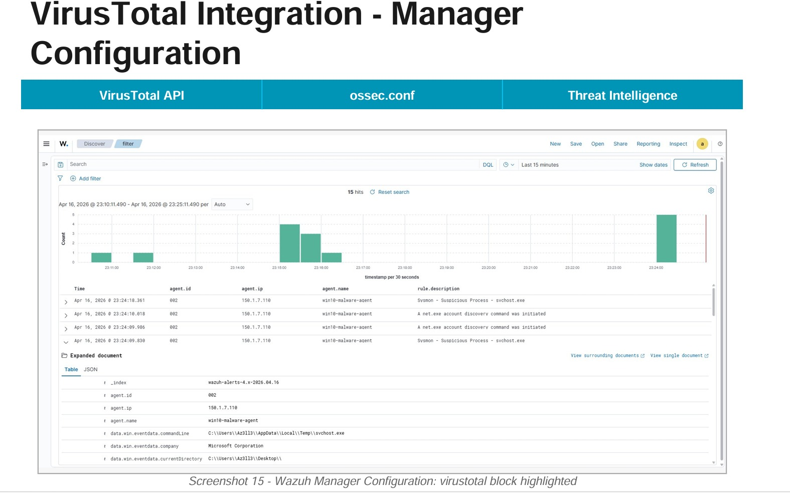

VirusTotal is a free online service owned by Google that aggregates results from 70+ antivirus engines, sandbox analyzers, and threat intelligence feeds. When integrated with Wazuh, every file hash detected by FIM is automatically submitted to VirusTotal in real time — transforming a basic file change alert into a threat intelligence-enriched security event that tells analysts not just that a file appeared, but whether it is known malware.

**How the integration works technically:**
When Wazuh FIM detects a new file, it computes the file's SHA256 hash and triggers a syscheck alert. The VirusTotal integration module intercepts this alert, extracts the hash, and submits it to the VirusTotal API via HTTPS. VirusTotal responds with a JSON payload containing the detection results from all 70+ engines. Wazuh parses this response and enriches the original FIM alert with the detection count, making it immediately visible in Discover as `data.virustotal.found=1`.

**Why this matters in real SOC operations:**
In enterprise environments, hundreds of files are created on endpoints every hour — software updates, temporary files, user downloads. A SOC analyst cannot manually investigate every FIM alert. VirusTotal integration acts as an automatic triage layer — files with zero detections are likely benign, files with high detection counts require immediate response. This dramatically reduces alert fatigue while ensuring known malware is never missed.

**The limitation analysts must understand:**
VirusTotal is powerful but not infallible. Custom malware, zero-day payloads, and freshly compiled tools will have zero VirusTotal detections — not because they are safe, but because they are new. A sophisticated attacker specifically compiles unique binaries to avoid signature detection. This is why VirusTotal enrichment must be combined with behavioral detection (Sysmon) and FIM — a file with zero VT detections that also spawns suspicious child processes is still highly suspicious.

**Key Points:**
- VirusTotal integration configured in Wazuh Manager ossec.conf
- Triggered on syscheck group events — every FIM detection auto-submitted
- SHA256 hash submitted to VirusTotal API via HTTPS in real time
- Response enriches alert with engine detection count and malware family names
- `alert_format=json` — structured output for SIEM parsing and dashboard display
- API key stored in Manager config — agents never directly contact VirusTotal
- Zero detections does not mean safe — behavioral analysis still required

---

## Step 16 — VirusTotal Verified — EICAR Test Detection

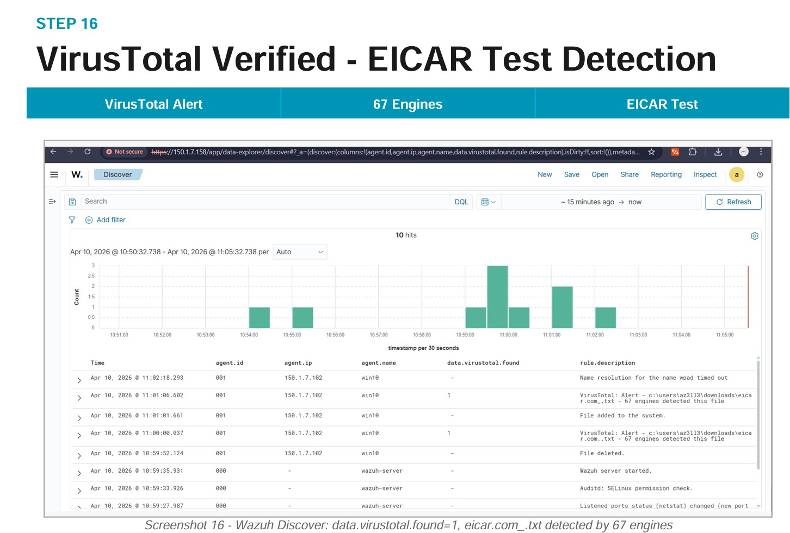

The EICAR test file is an industry-standard harmless string recognized by all major antivirus engines as a test virus. Dropping it into the monitored Downloads directory triggered the complete detection chain — FIM detected the file creation, Wazuh submitted the hash to VirusTotal, and the response confirmed detection by **67 out of 67 antivirus engines** — the maximum possible detection score. This end-to-end verification confirms every component of the pipeline is functioning correctly.

**Reading the Discover output like a SOC analyst:**
The 10 hits in the Discover view tell a complete story when read in chronological order:
- **Wazuh server started** — baseline event confirming manager is operational
- **SELinux permission check** — routine security audit event
- **Listened ports status changed** — network baseline change detected
- **File added to the system** — FIM Rule 554, EICAR file created in Downloads
- **VirusTotal Alert — 67 engines detected this file** — threat intelligence enrichment
- **File deleted** — FIM Rule 553, EICAR file removed after testing
- **VirusTotal Alert — 67 engines detected this file** — second submission on deletion hash

**Why the detection fired twice:**
VirusTotal submissions happen on both file creation (Rule 554) and file deletion (Rule 553) events because both trigger syscheck alerts. This is actually beneficial — it means even if an attacker deletes a malicious file immediately after execution, the hash was already submitted and flagged before the deletion occurred.

**Key Points:**
- EICAR test file detected by **67/67 antivirus engines** — maximum detection score
- `data.virustotal.found=1` visible in Discover — enrichment confirmed
- Full chain verified: file drop → FIM alert → VT submission → enriched alert
- Double submission on create and delete — no evasion window available
- 10 total hits capturing complete file lifecycle with threat intelligence overlay
- Confirms VirusTotal API key valid and Manager-to-VT connectivity working

## Step 17 — Behavioral Detection — Suspicious svchost.exe

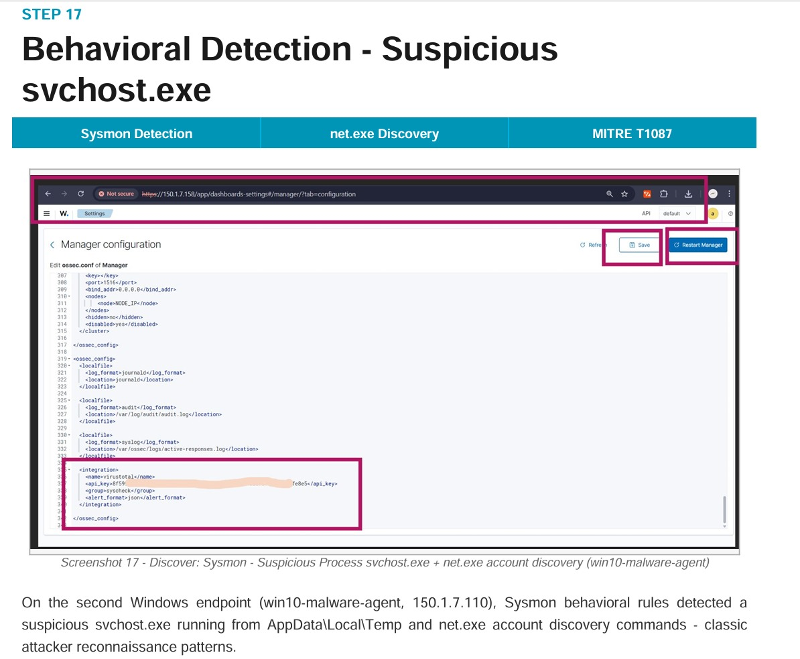

On the second Windows endpoint (win10-malware-agent, 150.1.7.110), Sysmon behavioral rules fired alerts for two highly suspicious activities occurring simultaneously — a svchost.exe process running from `AppData\Local\Temp` and net.exe account discovery commands. These two behaviors together form a classic attacker pattern that is virtually impossible to explain as legitimate activity.

**Why svchost.exe from AppData is a critical red flag:**
`svchost.exe` (Service Host) is one of the most legitimate and essential Windows processes — it hosts multiple Windows services and runs constantly on every Windows machine. Because of this, attackers frequently name their malware `svchost.exe` to blend into the process list and avoid detection by analysts doing quick visual reviews. The key differentiator is the **path**. Legitimate svchost.exe lives exclusively in `C:\Windows\System32\svchost.exe`. Any svchost.exe running from `AppData\Local\Temp`, `Downloads`, `Desktop`, or any user-writable directory is definitively malicious — there is no legitimate explanation for this behavior.

**This is exactly what Sysmon was built to catch:**
Default Windows Security logs show "svchost.exe started" — the path is not recorded. An analyst reviewing default logs would see a process name that appears completely normal. Sysmon Event ID 1 records the full executable path — `C:\Users\Az3113\AppData\Local\Temp\svchost.exe` — instantly exposing the masquerading attempt. This single capability demonstrates why Sysmon is considered essential infrastructure for any serious SOC.

**The net.exe account discovery explained:**
`net.exe` is a legitimate Windows administration tool used to manage users, groups, and network resources. Attackers abuse it extensively during the post-exploitation reconnaissance phase to enumerate domain users, local administrators, and active sessions. Commands like `net user`, `net localgroup administrators`, and `net group "Domain Admins"` are among the most commonly executed commands immediately after initial access — providing attackers with the information needed to identify high-value targets for lateral movement.

**MITRE ATT&CK mapping:**
- **T1036.005** — Masquerading: Match Legitimate Name or Location (svchost.exe impersonation)
- **T1087.001** — Account Discovery: Local Account (net.exe user enumeration)
- **T1087.002** — Account Discovery: Domain Account (net.exe domain group enumeration)

The combination of process masquerading and immediate account discovery is a textbook indicator of an attacker who has gained initial access and is beginning their internal reconnaissance phase.

**Key Points:**
- svchost.exe running from AppData\Local\Temp — definitive masquerading indicator
- Legitimate svchost.exe only ever runs from C:\Windows\System32
- net.exe account discovery — MITRE T1087 post-exploitation reconnaissance
- Agent: win10-malware-agent (150.1.7.110) — dedicated malware simulation endpoint
- Sysmon Event ID 1 captured full path — impossible to detect with default logs
- Two MITRE techniques detected simultaneously — strong indicator of active compromise

---

## Step 18 — Executable Drop — Malware Folder Detection

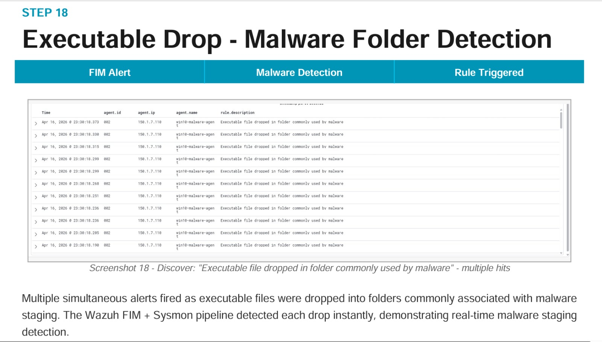

Multiple simultaneous alerts fired as executable files were dropped into directories commonly associated with malware staging. The Wazuh FIM and Sysmon pipeline detected each drop the instant it occurred, generating a burst of identical alerts all timestamped within milliseconds of each other — a pattern that itself is a high-confidence indicator of automated malware deployment rather than manual file copying.

**Why malware uses specific folders:**
Attackers and malware developers have learned through experience which Windows directories are most permissive and least monitored. User-writable directories that do not require administrator privileges — such as `AppData\Local\Temp`, `AppData\Roaming`, `ProgramData`, and user `Downloads` — are favored staging locations because malware can write to them without triggering UAC prompts. Many organizations specifically exclude these directories from monitoring because of the high volume of legitimate activity — creating a deliberate blind spot that sophisticated malware exploits.

**What the simultaneous alert burst reveals:**
The burst of identical alerts all firing at `23:30:18` within milliseconds of each other is not random — it is the signature of an automated dropper deploying multiple files simultaneously. Human operators copying files manually produce alerts spread across seconds or minutes. A dropper executing a batch file operation produces the exact burst pattern seen here. This temporal clustering is itself a detection signal that distinguishes automated malware deployment from legitimate administrative activity.

**The defender response this detection enables:**
When a SOC analyst sees this alert pattern they have a precise forensic starting point — the exact directory, the exact timestamp, and the exact agent. The next investigative steps are clear: pull the Sysmon Event ID 11 (File Create) logs for that directory at that timestamp to get file hashes, submit those hashes to VirusTotal, and review Sysmon Event ID 1 logs to identify which process dropped the files. This entire investigation can be completed in minutes with the Wazuh + Sysmon pipeline — compared to hours or days with default Windows logging.

**Key Points:**
- Multiple simultaneous hits — automated dropper signature detected
- All alerts at identical timestamp — distinguishes automation from manual activity
- Rule: "Executable file dropped in folder commonly used by malware"
- Agent: win10-malware-agent (150.1.7.110) — malware simulation confirmed
- FIM realtime mode detected each drop within milliseconds of file creation
- Correlate with Sysmon Event ID 11 (File Create) for full forensic chain
- MITRE T1105 — Ingress Tool Transfer | T1036 — Masquerading

## Lab Results Summary

| Step | Task | Result |
|------|------|--------|
| 01–03 | Wazuh Manager network setup & static IP | ✅ PASS |
| 04 | Lab connectivity verified — ping test | ✅ PASS |
| 05–07 | Wazuh Agent deployed & running on Windows 10 | ✅ PASS |
| 08–09 | Sysmon installed & configuration verified | ✅ PASS |
| 10 | Sysmon log forwarding & FIM configured | ✅ PASS |
| 11–12 | Brute-force attack detected — 38 alerts | ✅ PASS |
| 13–14 | FIM configured & file lifecycle events captured | ✅ PASS |
| 15–16 | VirusTotal integration — EICAR 67 engines | ✅ PASS |
| 17 | Behavioral detection — suspicious svchost.exe + net.exe | ✅ PASS |
| 18 | Executable drop detection — malware staging | ✅ PASS |

**Overall: 10/10 Tasks Passed — Full SOC Pipeline Verified ✅**

---

## MITRE ATT&CK Coverage

| Technique | ID | Detection Method |
|-----------|-----|-----------------|
| Brute Force — Password Guessing | T1110.001 | Wazuh composite rule — Event ID 4625 correlation |
| Valid Accounts | T1078 | Event ID 4624 + 4672 sequence correlation |
| Windows Service Persistence | T1543.003 | Service startup type change alert |
| Masquerading — Process Name | T1036.005 | Sysmon Event ID 1 full path logging |
| Account Discovery — Local | T1087.001 | Sysmon net.exe execution detection |
| Account Discovery — Domain | T1087.002 | Sysmon net.exe domain group enumeration |
| Ingress Tool Transfer | T1105 | FIM realtime executable drop detection |
| File Deletion | T1070.004 | FIM Rule 553 realtime deletion alert |

---

## Key Takeaways

**For SOC analysts:**
- Default Windows logs are insufficient for modern threat detection — Sysmon is essential infrastructure
- Brute-force detection requires composite rule correlation, not single event matching
- File deletion alerts are as valuable as creation alerts — attacker cleanup activity is evidence
- VirusTotal enrichment provides automatic triage but must be combined with behavioral analysis
- Temporal clustering of alerts reveals automated malware deployment vs manual activity

**For defenders:**
- Static SIEM manager IP is non-negotiable — DHCP creates agent connectivity blind spots
- Realtime FIM closes the scan interval gap that attackers exploit to stage and clean up tools
- svchost.exe path verification catches one of the most common malware masquerading techniques
- VirusTotal zero detections does not mean safe — zero-day and custom malware bypass signatures
- The Wazuh + Sysmon pipeline reduces investigation time from hours to minutes

---

## Skills Demonstrated

`SIEM Deployment` `Windows Endpoint Monitoring` `Sysmon Configuration` `Threat Intelligence`
`Brute-Force Detection` `File Integrity Monitoring` `Behavioral Detection` `Malware Staging Detection`
`VirusTotal API Integration` `MITRE ATT&CK Mapping` `Detection Engineering` `Incident Investigation`
`Wazuh` `Sysmon` `VMware` `PowerShell` `Event Correlation` `SOC Operations`

---

*Ayesha | Information Security Analyst | April 2026*

